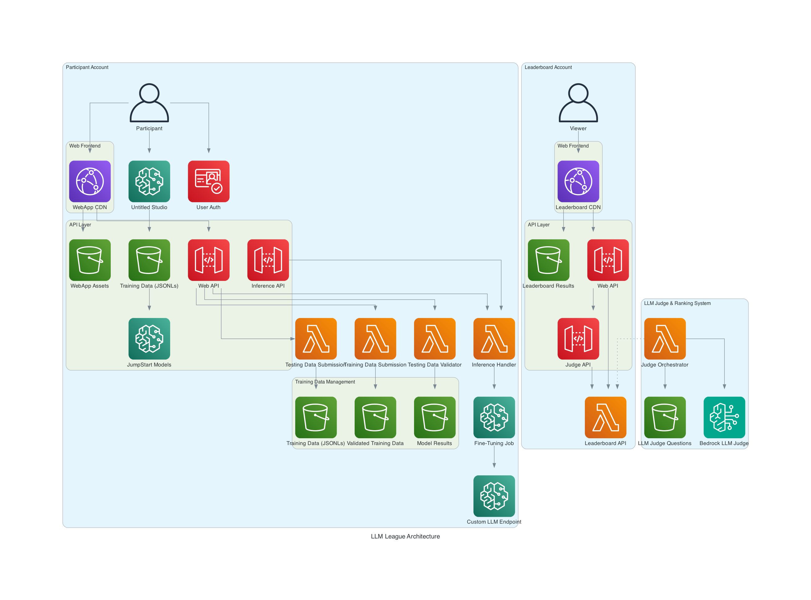
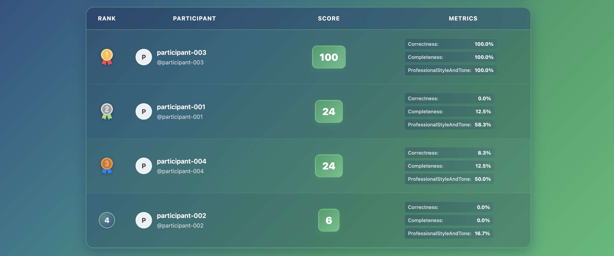
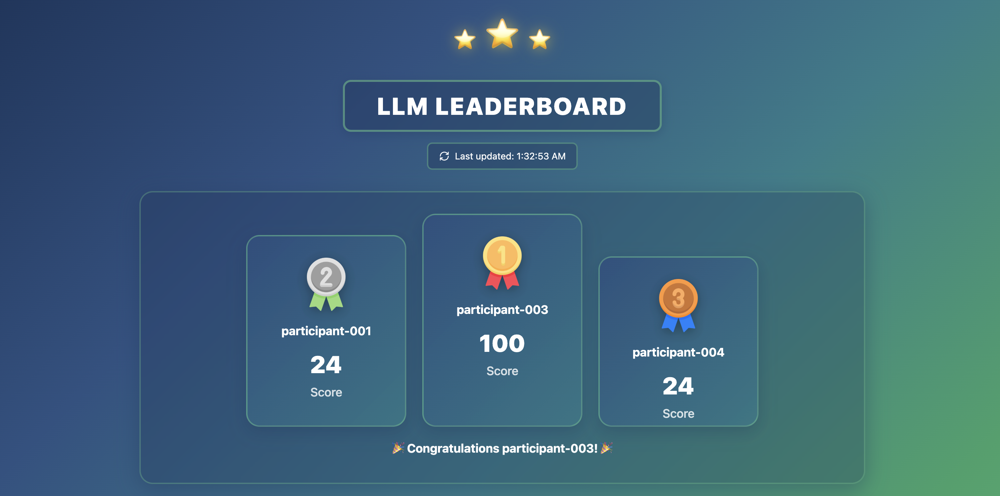
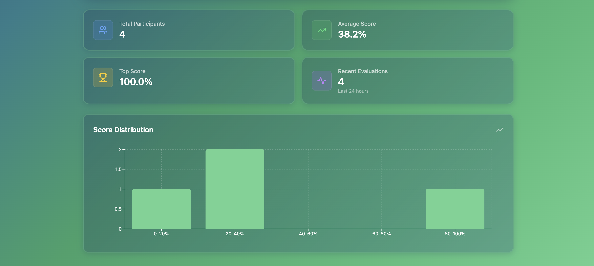

# LLM League Leaderboard Account

The **Leaderboard Account** component of the LLM League platform, responsible for evaluating, ranking, and displaying Large Language Model (LLM) performance using AWS Bedrock as an impartial judge.

## Architecture Overview



The leaderboard account operates as part of a LLM League architecture that ensures fair and secure evaluation of participant models. This account focuses on:

- **Model Evaluation**: Using Amazon Bedrock as an impartial AI judge
- **Ranking Management**: Processing and storing leaderboard rankings via Lambda functions
- **Public Display**: Serving leaderboard results through a web interface

## Leaderboard Account Components

### Web Frontend
- **CloudFront CDN**: Global content delivery for the public leaderboard interface
- **S3 Static Hosting**: React-based web application for displaying rankings and statistics

### API Layer
- **Web API (API Gateway)**: Serves leaderboard data to the frontend application
- **Judge API (API Gateway)**: Receives evaluation requests from participant accounts
- **Leaderboard API (Lambda)**: Central component managing all leaderboard operations, rankings, and data storage

### LLM Judge & Ranking System
- **Judge Orchestrator (Lambda)**: Coordinates the evaluation workflow and manages judge interactions
- **Amazon Bedrock**: AI-powered impartial judge for model evaluation using state-of-the-art LLMs
- **Judge Criteria (S3)**: Configurable evaluation criteria, scoring guidelines, and rubrics for consistent judging

### Data Storage
- **Leaderboard Results (S3)**: Current rankings, historical data, and detailed evaluation results

## Features

### 🏆 **Automated Model Evaluation**
- Fair evaluation using Amazon Bedrock as an impartial judge
- Configurable evaluation criteria and scoring rubrics
- Support for multiple evaluation dimensions:
  - **Builtin.Correctness**: Factual accuracy and precision of responses
  - **Builtin.Completeness**: Thoroughness and coverage of the topic
  - **Builtin.ProfessionalStyleAndTone**: Communication quality and appropriateness
- Automated ranking calculation and updates

### 📊 **Scoring System**
- **Score Range**: 0.0 to 1.0 (normalized scores)
- **Total Score**: Average of all metric scores
- **Individual Metrics**: Each dimension scored independently
- **Ranking Logic**: 
  - Primary: Based on total score (highest first)
  - Tiebreaker: Earlier timestamp wins (first submission advantage)
  - Precision: Scores calculated to high precision to minimize ties
- **Evaluation Count**: Number of test cases evaluated per participant

#### Tiebreaker Handling
When participants have identical total scores, the system uses timestamp-based tiebreaking:
- **Earlier Submission Wins**: Participant who submitted first gets the higher rank
- **Fairness**: Encourages early participation and prevents gaming
- **Consistency**: Deterministic ranking that doesn't change unless scores change

Example tiebreaker scenario:
```json
{
  "participant-001": {
    "totalScore": 0.236,
    "timestamp": 1754811115,  // Earlier submission
    "rank": 2                 // Gets higher rank
  },
  "participant-004": {
    "totalScore": 0.236,
    "timestamp": 1754839956,  // Later submission  
    "rank": 3                 // Gets lower rank
  }
}
```

### 📊 **Real-Time Leaderboard**
- Live rankings with automatic updates
- Detailed performance metrics and score breakdowns
- Historical performance tracking
- Interactive charts and statistics

## Application Screenshots

### 🏆 Leaderboard View
The main leaderboard interface showing current rankings and participant performance:



### 🥇 Podium Rankings
Top performers displayed in an engaging podium format:



### 📈 Performance Analysis
Detailed analytics and performance metrics for comprehensive evaluation insights:



## Quick Start

### Prerequisites
- AWS Account with appropriate permissions
- Amazon Bedrock access enabled
- AWS CLI configured
- Node.js 18+ and npm installed
- AWS CDK v2 installed

### 1. Clone and Setup
```bash
git clone https://github.com/hcwongleo/llm-league-leaderboard.git
cd llm-league-leaderboard/leaderboard-account
npm install
```

### 2. Deploy Infrastructure
```bash
# Deploy CDK stack directly
npm run deploy

# Or use the deployment script
./deploy.sh
```

**Note**: All configuration is handled directly in the CDK stack code (`lib/leaderboard-stack.ts`). No `.env` file is needed for deployment.
```bash
# Deploy CDK stack
npm run deploy

# Or use the deployment script
./deploy.sh
```

### 3. Upload Judge Criteria
```bash
# Judge criteria are automatically deployed by CDK
# But you can also upload manually if needed:
aws s3 cp judge-criteria/judge-criteria.json s3://llm-judge-criteria-${AWS_ACCOUNT_ID}-${AWS_REGION}/
```

### 4. Deploy Frontend
```bash
cd frontend
npm install
npm run build

# Deploy to S3 and invalidate CloudFront
aws s3 sync dist/ s3://your-frontend-bucket/
aws cloudfront create-invalidation --distribution-id YOUR_DISTRIBUTION_ID --paths "/*"
```

### Judge Criteria Format
```json
{
  "evaluation_criteria": [
    {
      "category": "accuracy",
      "weight": 0.4,
      "description": "Factual correctness and precision",
      "questions": [
        "How accurate is the model's response?",
        "Does the response contain factual errors?"
      ]
    },
    {
      "category": "coherence",
      "weight": 0.3,
      "description": "Logical structure and flow",
      "questions": [
        "Is the response logically structured?",
        "Does the response flow naturally?"
      ]
    },
    {
      "category": "relevance",
      "weight": 0.3,
      "description": "Relevance to the prompt",
      "questions": [
        "How relevant is the response to the prompt?",
        "Does the response address all aspects of the question?"
      ]
    }
  ],
  "scoring": {
    "scale": "1-10",
    "description": "1 = Poor, 5 = Average, 10 = Excellent"
  }
}
```

## API Reference

### Leaderboard API Endpoints

#### GET /leaderboard
Get current leaderboard rankings
```bash
curl https://your-api-gateway-url/leaderboard
```

Response:
```json
{
  "rankings": [
    {
      "participantId": "participant-003",
      "modelName": "participant-003",
      "totalScore": 1.0,
      "metricScores": {
        "Builtin.Correctness": 1.0,
        "Builtin.Completeness": 1.0,
        "Builtin.ProfessionalStyleAndTone": 1.0
      },
      "evaluationCount": 6,
      "timestamp": 1754832901,
      "status": "COMPLETED",
      "rank": 1
    },
    {
      "participantId": "participant-001",
      "modelName": "participant-001",
      "totalScore": 0.236,
      "metricScores": {
        "Builtin.Correctness": 0.0,
        "Builtin.Completeness": 0.125,
        "Builtin.ProfessionalStyleAndTone": 0.583
      },
      "evaluationCount": 6,
      "timestamp": 1754811115,
      "status": "COMPLETED",
      "rank": 2
    }
  ],
  "timestamp": 1754873324,
  "count": 4
}
```

#### POST /evaluate
Submit model results for evaluation (called by participant accounts)

**Example from test.sh:**
```bash
curl -X POST "${JUDGE_API_URL}/evaluate" \
  -H "Content-Type: application/json" \
  -d '{
    "participantId": "participant-004",
    "presignedUrl": "https://your-s3-bucket.s3.amazonaws.com/mock-bedrock-dataset004.jsonl?[presigned-url-params]"
  }'
```

**Required JSONL Format for Bedrock LLM Judge:**

The presigned URL must point to a JSONL file where each line contains a complete evaluation record:

```json
{
  "prompt": "Write a 15 words summary of this text:\n\nAWS Fargate is a technology that you can use to run containers without having to manage servers or clusters...",
  "referenceResponse": "Fargate runs containers serverlessly, removing server management, VM provisioning, and cluster scaling complexities.",
  "category": "summarization",
  "modelResponses": [
    {
      "response": "AWS Fargate is a container service that helps with running applications in the cloud using Docker containers.",
      "modelIdentifier": "participant-004"
    }
  ]
}
```

**Testing:**
Use the provided test script to validate your endpoint:
```bash
cd test/
./test.sh https://your-judge-api-url.amazonaws.com/prod
```
