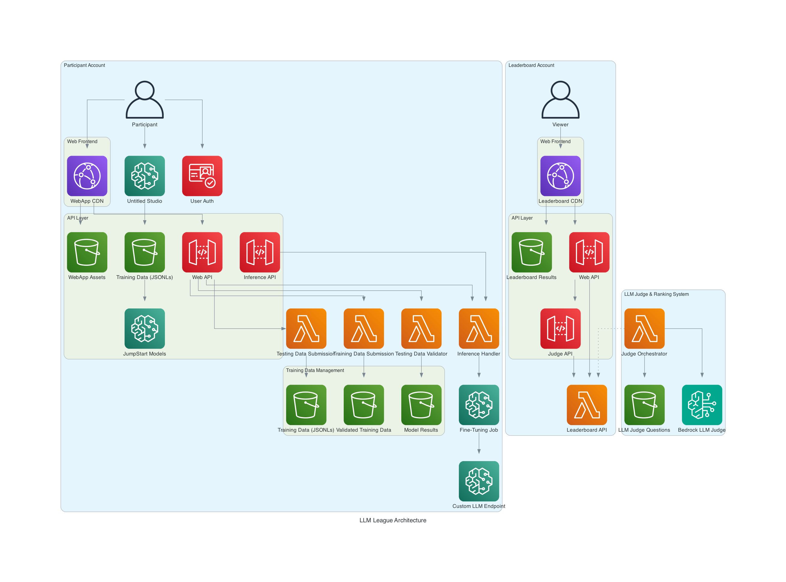

# LLM League Leaderboard Account

The **Leaderboard Account** component of the LLM League platform, responsible for evaluating, ranking, and displaying Large Language Model (LLM) performance using AWS Bedrock as an impartial judge.

## Architecture Overview



The leaderboard account operates as part of a multi-account architecture that ensures fair and secure evaluation of participant models. This account focuses on:

- **Model Evaluation**: Using Amazon Bedrock as an impartial AI judge
- **Ranking Management**: Processing and storing leaderboard rankings via Lambda functions
- **Public Display**: Serving leaderboard results through a web interface
- **Cross-Account Security**: Secure integration with participant accounts

## Leaderboard Account Components

### Web Frontend
- **CloudFront CDN**: Global content delivery for the public leaderboard interface
- **S3 Static Hosting**: React-based web application for displaying rankings and statistics

### API Layer
- **Web API (API Gateway)**: Serves leaderboard data to the frontend application
- **Judge API (API Gateway)**: Receives evaluation requests from participant accounts
- **Leaderboard API (Lambda)**: Central component managing all leaderboard operations, rankings, and data storage

### LLM Judge & Ranking System
- **Judge Orchestrator (Lambda)**: Coordinates the evaluation workflow and manages judge interactions
- **Amazon Bedrock**: AI-powered impartial judge for model evaluation using state-of-the-art LLMs
- **Judge Questions (S3)**: Configurable evaluation criteria, prompts, and scoring rubrics

### Data Storage
- **Leaderboard Results (S3)**: Current rankings, historical data, and detailed evaluation results

## Recent Architecture Updates

### Lambda-Based Data Management (August 2025)
- **Replaced DynamoDB with Leaderboard API Lambda**: Simplified architecture by centralizing all leaderboard operations in a dedicated Lambda function
- **Enhanced Scalability**: Serverless approach provides better cost optimization and automatic scaling
- **Streamlined Data Flow**: Direct integration between Judge Orchestrator and Leaderboard API Lambda for faster updates
- **Improved API Design**: Single Lambda function handles all leaderboard operations (GET, POST, rankings, statistics)

## Features

### 🏆 **Automated Model Evaluation**
- Fair evaluation using Amazon Bedrock as an impartial judge
- Configurable evaluation criteria and scoring rubrics
- Support for multiple evaluation dimensions (accuracy, coherence, relevance)
- Automated ranking calculation and updates

### 📊 **Real-Time Leaderboard**
- Live rankings with automatic updates
- Detailed performance metrics and score breakdowns
- Historical performance tracking
- Interactive charts and statistics

### 🔒 **Secure Cross-Account Integration**
- Presigned URL access for participant model results
- IAM-based cross-account permissions with least privilege
- Audit logging for all evaluation activities
- Secure API endpoints with authentication

### ⚡ **Serverless Architecture**
- Cost-effective Lambda-based processing
- Automatic scaling based on demand
- High availability with multi-AZ deployment
- CloudWatch monitoring and alerting

## Quick Start

### Prerequisites
- AWS Account with appropriate permissions
- Amazon Bedrock access enabled
- AWS CLI configured
- Node.js 18+ and npm installed
- AWS CDK v2 installed

### 1. Clone and Setup
```bash
git clone https://github.com/hcwongleo/llm-league-leaderboard.git
cd llm-league-leaderboard/leaderboard-account
npm install
```

### 2. Deploy Infrastructure
```bash
# Deploy CDK stack directly
npm run deploy

# Or use the deployment script
./deploy.sh
```

**Note**: All configuration is handled directly in the CDK stack code (`lib/leaderboard-stack.ts`). No `.env` file is needed for deployment.
```bash
# Deploy CDK stack
npm run deploy

# Or use the deployment script
./deploy.sh
```

### 3. Upload Judge Questions
```bash
# Judge questions are automatically deployed by CDK
# But you can also upload manually if needed:
aws s3 cp judge-questions/judge-questions.json s3://llm-judge-questions-${AWS_ACCOUNT_ID}-${AWS_REGION}/
```

### 4. Deploy Frontend
```bash
cd frontend
npm install
npm run build

# Deploy to S3 and invalidate CloudFront
aws s3 sync dist/ s3://your-frontend-bucket/
aws cloudfront create-invalidation --distribution-id YOUR_DISTRIBUTION_ID --paths "/*"
```

## Configuration

### Judge Questions Format
```json
{
  "evaluation_criteria": [
    {
      "category": "accuracy",
      "weight": 0.4,
      "description": "Factual correctness and precision",
      "questions": [
        "How accurate is the model's response?",
        "Does the response contain factual errors?"
      ]
    },
    {
      "category": "coherence",
      "weight": 0.3,
      "description": "Logical structure and flow",
      "questions": [
        "Is the response logically structured?",
        "Does the response flow naturally?"
      ]
    },
    {
      "category": "relevance",
      "weight": 0.3,
      "description": "Relevance to the prompt",
      "questions": [
        "How relevant is the response to the prompt?",
        "Does the response address all aspects of the question?"
      ]
    }
  ],
  "scoring": {
    "scale": "1-10",
    "description": "1 = Poor, 5 = Average, 10 = Excellent"
  }
}
```

### Configuration

All configuration is handled directly in the CDK stack code (`lib/leaderboard-stack.ts`). Key settings include:

**Bedrock Configuration:**
```typescript
BEDROCK_MODEL_ID: 'anthropic.claude-3-sonnet-20240229-v1:0'
```

**S3 Bucket Names (auto-generated):**
- Judge Questions: `llm-judge-questions-{account}-{region}`
- Participant Results: `llm-participant-results-{account}-{region}`  
- Evaluation Output: `llm-evaluation-output-{account}-{region}`

**Frontend Environment Variables (for local development only):**
```bash
# Create frontend/.env.local for local development
VITE_API_BASE_URL=https://your-api-gateway-url.amazonaws.com/prod
```

To change the Bedrock model or other settings, edit the CDK stack code directly.

## API Reference

### Leaderboard API Endpoints

#### GET /leaderboard
Get current leaderboard rankings
```bash
curl https://your-api-gateway-url/leaderboard
```

Response:
```json
{
  "rankings": [
    {
      "rank": 1,
      "model_name": "CustomLLM-v1",
      "participant": "team-alpha",
      "overall_score": 8.7,
      "scores": {
        "accuracy": 9.1,
        "coherence": 8.5,
        "relevance": 8.5
      },
      "evaluation_date": "2025-08-10T16:00:00Z"
    }
  ],
  "total_participants": 15,
  "last_updated": "2025-08-10T16:30:00Z"
}
```

#### POST /evaluate
Submit model results for evaluation (called by participant accounts)
```bash
curl -X POST https://your-api-gateway-url/evaluate \
  -H "Content-Type: application/json" \
  -d '{
    "participant_id": "team-alpha",
    "model_name": "CustomLLM-v1",
    "results_url": "https://presigned-s3-url...",
    "metadata": {
      "model_type": "fine-tuned-llama2",
      "training_data_size": "10k_samples"
    }
  }'
```
